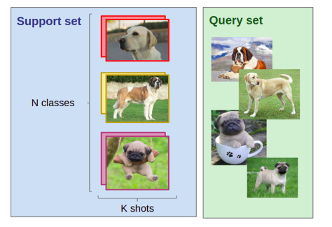
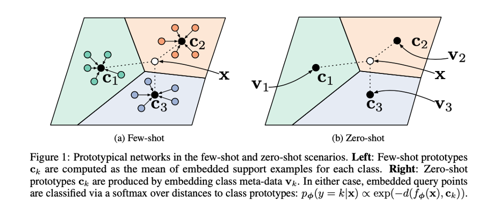
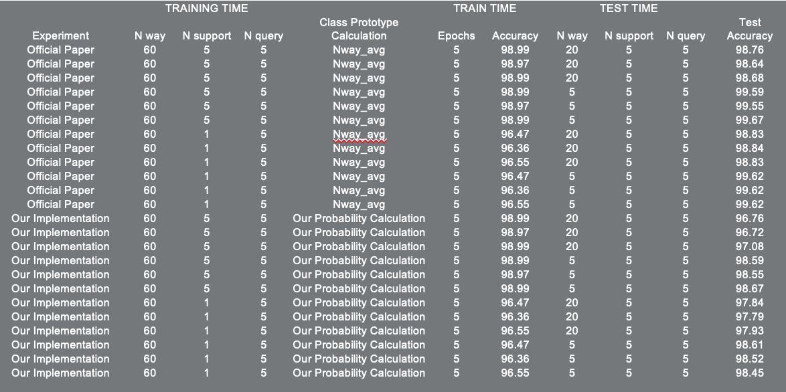

# Few-Shot-Classification-with-Prototypical-Networks

## Background
- Resembling the rapid learning capability of human, low shot learning empowers vision systems to understand new concepts by training with few samples 
We first define the N-way K-shot image classification task. 

Given: a support set composed of N labels and, for each label, K labeled images; a query set composed of Q query images; the task is to classify the query images among the N classes given the N×K images in the support set. When K is small (typically K<10), we talk about few-shot image classification (or one-shot in the case where K=1).

<div align="center">
  
</div>

- Prototypical Networks is based on the concept that there exists an embedding in which points cluster around a single prototype representation for each class
 Few shot classification is a task in which the classifier has to accommodate new classes during test time given only a few example of these classes

## Introduction

Prototypical Networks is based on the concept that there exists an embedding in which points cluster around a single prototype representation for each class
In order to do the above a non linear mapping of the input is taken into an embedded space using neural networks and take the classes’s prototype to be the mean of its support set in the embedding space
Classification is then performed for an embedded query point by simply finding the nearest class prototype
Therefore an embedding of the meta-data is learned into a shared space to serve as a prototype for each class
It is found that choice of the distance is quintessential to the problem and Euclidean distance greatly outperforms cosine similarity

Our Novel Approach :

Instead of representing  the classes’s prototype to be the mean of its support set, we consider each example in the support set to be a class prototype and allow our images from the query set to map to the the embedding space, closest to these prototypes
We consider that taking the mean of the class prototype isn’t necessarily representative of the class 

<div align="center">
  
</div>

## Presentation 
```
Download the file Few_Shot_Classification.pptx
```

## Installation
#### Download project files
```
git clone https://github.com/shayeree96/11785-CMU---FCOS-with-MLFPN
```
#### Set up environment
```
conda env create -f environment.yaml`
pip install -r requirements.txt
```
#### Download dataset
Navigate to the project root directory

Download tar files of Omniglot dataset :
```
API Command : kaggle datasets download -d watesoyan/omniglot
Kaggle url : https://www.kaggle.com/watesoyan/omniglot
```
A folder called omniglot will be created. Inside the folder two subfolders will have been created images_background and images_evaluation

## Training
Navigate to the project root directory

Run:
```
python Prototypical_Networks.py
```
By default, for training :
```
n_way = 60
n_support = 5
n_query = 5

max_epoch = 5
epoch_size = 2000

```
By default, for testing :
```
n_way = 20
n_support = 5
n_query = 5

max_epoch = 5
epoch_size = 2000

```

Our Experiemental results on the the Omniglot Dataset are able to achieve accuracy at par with that of the Official paper [https://arxiv.org/abs/1703.05175] 
<div align="center">
  
</div>


